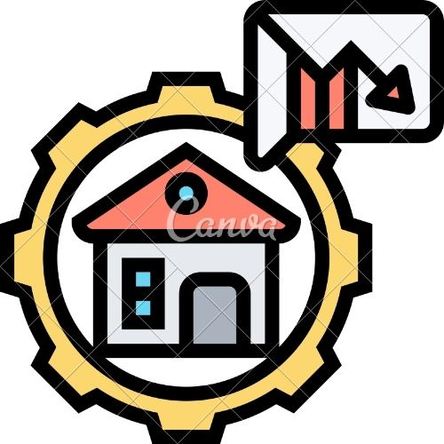

<!-- PROJECT SHIELDS -->
[![Stargazers][stars-shield]][stars-url]
[![Issues][issues-shield]][issues-url]
[![LinkedIn][linkedin-shield]][linkedin-url]

<!-- PROJECT LOGO -->
<br />
<p align="center">
  <a href="https://github.com/aindrajaya/lending-dapp">
    
  </a>

  <h3 align="center">Lending dApps</h3>

  <p align="center">
    Lending App using Blockchain Ethereum for Learning Purpose
    <br />
    <a href="https://github.com/aindrajaya/lending-dapp"><strong>Explore the docs »</strong></a>
    <br />
    <br />
    <a href="https://github.com/aindrajaya/lending-dapp">View Demo</a>
    ·
    <a href="https://github.com/aindrajaya/lending-dapp/issues">Report Bug</a>
    ·
    <a href="https://github.com/aindrajaya/lending-dapp/issues">Request Feature</a>
  </p>
</p>

<!-- TABLE OF CONTENTS -->
<details open="open">
  <summary>Table of Contents</summary>
  <ol>
    <li>
      <a href="#about-the-project">About The Project</a>
      <ul>
        <li><a href="#built-with">Built With</a></li>
      </ul>
    </li>
    <li>
      <a href="#getting-started">Getting Started</a>
      <ul>
        <li><a href="#prerequisites">Prerequisites</a></li>
        <li><a href="#installation">Installation</a></li>
      </ul>
    </li>
    <li><a href="#roadmap">Roadmap</a></li>
    <li><a href="#contact">Contact</a></li>
    <li><a href="#acknowledgements">Acknowledgements</a></li>
  </ol>
</details>

<!-- ABOUT THE PROJECT -->
## About the Lending dApps (Decentralized Applications)
[![Product Name Screen Shot][product-screenshot]](https://aindrajaya.github.io/lending-dapp)

So this project is the  DAO (Decentralized Autonomous Organisation) focusing on a decentralized peer-to-peer lending that build on [Ethereum](https://ethereum.org/en/) networks, and the simple example Ethereum blockchain integration on the website application with another case by building an example of **peer-to-peer lending dApp**.

Here's why and my purpose for this Learning Repository:
* Lending app is the common case study to learn on how the Finance Technology works
* And I also want to make it more clear on how Integrate each functions from smart contract to our website that and it can be store on the Ethereum blockchain networks.

And here's another purpose for this project is to Utilizing blockchain technology, borrowers and lenders are able to enter a loan agreement without the need for an intermediary. Instead, self-executing smart contracts enable trustless transactions.

A list of commonly used resources that I find helpful are listed in the acknowledgements.

### Built With
This projects is built with
#### First Phase
* [Vue](https://vuejs.org)
* [Ethereum](https://ethereum.org/en/)
* [Truffle](https://trufflesuite.com/)
* [Ganacle-cli/Ganache](https://github.com/trufflesuite/ganache)

#### Second Phase (Will be change to)
* [React](https://reactjs.org/)
* [Redux-saga](https://redux-saga.js.org/)
* [Ethereum](https://ethereum.org/en/)
* [Truffle](https://trufflesuite.com/)
* [Ganacle-cli/Ganache](https://github.com/trufflesuite/ganache)


<!-- GETTING STARTED -->
## Getting Started

This is an example of how you may give instructions on setting up your project locally.
To get a local copy up and running follow these simple example steps.

### Prerequisites

This is an example of how to list things you need to use the software and how to install them. (if you haven't any `npm` installation before)
  * To install npm and Node You can follow this [link](https://nodejs.org/en/download/)

### Installation

1. Clone the repo
   ```sh
   git clone https://github.com/aindrajaya/lending-dapp.git
   ```
2. Install the dependencies, for the **root** project and ~~**frontend**~~ folder. If you have any problems to install, you can use `--force` after `npm install`
   ```sh
   npm install
   ```
3. Compile the smart contract from `contratcs/` foldere
   ```sh
   npm run compile
   ```
4. Running the Ganache-cli (or you can use [Ganache](https://github.com/trufflesuite/ganache))
   ```sh
   ganache-cli
   ```   
5. Migrate the Contract to your local blockchain environment
   ```sh
   npm run migrate:dev
   ```  
6. ~~Go to the **Frontend** folder, and make sure the dependencies installed properly, and then run the frontend application~~
   ```sh
   cd frontend
   npm run start
   ```
7. You can import the private key from ganache/ganache-cli into your Metamask Wallet by copy the private key.
  ```dosini
  Example
  Private Keys
  ==================
  (0) 0x0288d45fb524afdb2903500571fe8cdb92ddc01114df58ac53a7930beddb289d
  (1) 0xb708cabc7774744275d5b0d0082ddcd9d105ec8278c6895c50c7c0a3db99dbb8
  ```


<!-- ROADMAP -->
## Roadmap

See the [open issues](https://github.com/aindrajaya/lending-dapp/issues) for a list of proposed features (and known issues).


<!-- CONTACT -->
## Contact
Arista - [@Arista_Indra](https://twitter.com/Arista_Indra) - arista.indrajay@gmail.com

Project Link: [Lending dApp](https://github.com/aindrajaya/lending-dapp)


<!-- ACKNOWLEDGEMENTS -->
## Acknowledgements
* [GitHub Emoji Cheat Sheet](https://www.webpagefx.com/tools/emoji-cheat-sheet)
* [Img Shields](https://shields.io)
* [Choose an Open Source License](https://choosealicense.com)
* [GitHub Pages](https://pages.github.com)
* [React](https://reactjs.org/)
* [Redux-saga](https://redux-saga.js.org/)
* [Ethereum](https://ethereum.org/en/)
* [Vue](https://vuejs.org)
* [Truffle](https://trufflesuite.com/)
* [Ganacle-cli/Ganache](https://github.com/trufflesuite/ganache)


<!-- MARKDOWN LINKS & IMAGES -->
<!-- https://www.markdownguide.org/basic-syntax/#reference-style-links -->
[stars-shield]: https://img.shields.io/github/stars/aindrajaya/lending-dapp.svg?style=for-the-badge
[stars-url]: https://github.com/aindrajaya/lending-dapp/stargazers
[issues-shield]: https://img.shields.io/github/issues/aindrajaya/lending-dapp.svg?style=for-the-badge
[issues-url]: https://github.com/aindrajaya/lending-dapp/issues
[linkedin-shield]: https://img.shields.io/badge/-LinkedIn-black.svg?style=for-the-badge&logo=linkedin&colorB=555
[linkedin-url]: https://www.linkedin.com/in/aindrajaya
[product-screenshot]: images/screenshot.png
